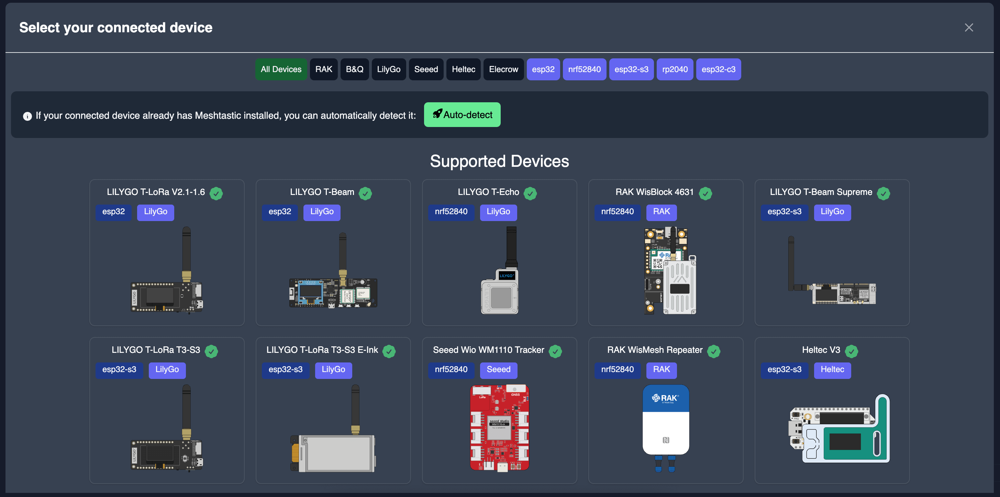
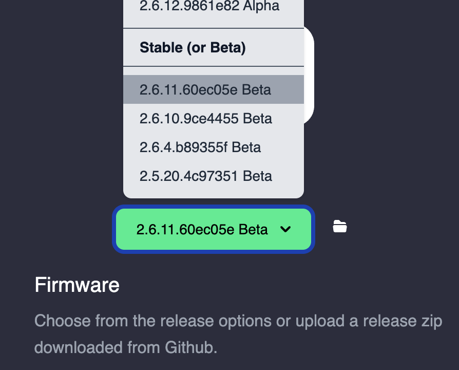

# Flashear firmware

Dependiendo de que dispositivo tengas tendrás que seguir los pasos para ESP32 o para NRF52:

## ESP32

:::info
Antes de empezar debes tener los drivers instalados para tu dispositivo: [Instalar los Controladores Seriales](configuracion_inicial.md#instalar-los-controladores-seriales)
:::

# Flashear dispositivo

- Conecta tu dispositivo
- Visita [flasher.meshtastic.org](https://flasher.meshtastic.org). **Requiere navegador Chrome o Edge**.
- Selecciona tu tipo de dispositivo:

    

- Selecciona la última versión estable:

    

- Pulsa en el botón de Flash y sigue las instrucciones. Si tu dispositivo es un ESP32-S3, puede que necesites apagarlo, luego mantener pulsado el botón BOOT / USR mientras conectas el cable USB.
  También puedes probar el método de reinicio a 1200bps para poner el dispositivo en modo adecuado.
- Si es la primera vez que instalas debes pulsar el botón de borrado completo.
- Pulsa el botón de instalar y verás un cuadro donde saldrá el proceso.
- Ya tienes tu dispositivo flasheado y puedas pasar a [Conectar y Configurar el Dispositivo](configuracion_inicial.md#conectar-y-configurar-el-dispositivo).

:::danger
Recuerda que no debes encender tu dispositivo sin una antena conectada
:::

## NRF52 y RP2040

:::info
Para estos dispositivos no hace falta instalar drivers. (En caso de Windows)
:::

### nRF52

1. Descarga y descomprime el último firmware desde el [Meshtastic flasher](https://flasher.meshtastic.org/).
2. Conecta tu dispositivo al ordenador con un cable USB de datos.
3. Pulsa dos veces el botón de reset en tu dispositivo (esto lo pondrá en modo bootloader).
4. Aparecerá una nueva unidad montada en tu ordenador (Windows, Mac, Linux o Android).
5. Abre esta unidad y deberías ver tres archivos: `CURRENT.UF2`, `INDEX.HTM` y `INFO_UF2.TXT`.
6. Copia el archivo de firmware apropiado (`firmware-DEVICE_NAME-X.X.X-xxxxxxx.uf2`) desde la versión descargada a esta unidad.
7. Una vez que el archivo haya terminado de copiarse, el dispositivo se reiniciará e instalará el firmware de Meshtastic.

### RP2040

1. Descarga y descomprime el último firmware desde el [Meshtastic flasher](https://flasher.meshtastic.org/).
2. Pulsa el botón BOOTSEL y, manteniéndolo pulsado, conecta el dispositivo al ordenador vía USB.
3. Aparecerá una nueva unidad montada en tu ordenador (Windows, Mac, Linux o Android).
4. Abre esta unidad y deberías ver dos archivos: `INDEX.HTM` y `INFO_UF2.TXT`.
5. Copia el archivo de firmware apropiado (`firmware-DEVICE_NAME-X.X.X-xxxxxxx.uf2`) desde la versión descargada a esta unidad.
6. Una vez que el archivo haya terminado de copiarse, el dispositivo se reiniciará e instalará el firmware de Meshtastic.

### Casos especiales posibles al flashear

:::info

Antes de flashear, confirma que tienes un [RAK4631](https://docs.rakwireless.com/product-categories/wisblock/rak4631/overview) y no un [RAK4631-R](https://docs.rakwireless.com/product-categories/wisblock/rak4631-r/overview). Si no es así, no te preocupes. El hardware es idéntico pero requiere cambiar el bootloader. Las instrucciones para hacerlo están [aquí](https://meshtastic.org/docs/getting-started/flashing-firmware/nrf52/convert-rak4631r/).

:::

:::info

Versiones anteriores del firmware de Meshtastic pueden guardar datos obsoletos, causando que los dispositivos se queden en un bucle de bloqueo al arrancar. Si tienes problemas al actualizar tu dispositivo nRF52 desde una versión previa, puede que necesites realizar un reinicio de fábrica completo de la memoria flash interna.

Sigue la guía para [borrar de fábrica tu dispositivo nRF52](https://meshtastic.org/docs/getting-started/flashing-firmware/nrf52/nrf52-erase/) antes de continuar para flashear el firmware.

:::

---

Ya tienes tu dispositivo flasheado y puedas pasar a [Conectar y Configurar el Dispositivo](configuracion_inicial.md#conectar-y-configurar-el-dispositivo).
