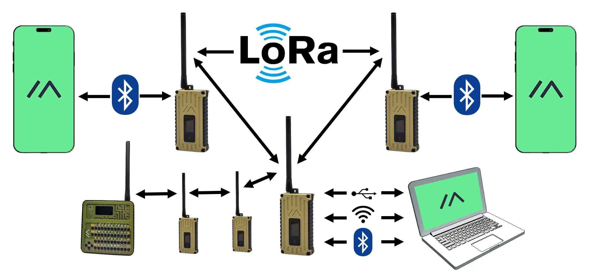

# Introducción

Meshtastic© es un proyecto que permite crear redes de comunicación, malladas y descentralizadas al margen de Internet. Está diseñado para operar via radio bajo el protocolo LoRa, usando dispositivos pequeños y económicos. Es perfecto para hablar con otras personas en lugares donde no hay cobertura de móvil, como en excursiones, campamentos o emergencias. Esta guía te ayudará a empezar de forma sencilla, incluso si no eres una persona técnica.

## Características de Meshtastic

- Red de largo alcance
- Comunicación descentralizada y encriptada
- Excelente duración de la batería
- Envío y recepción de mensajes de texto entre miembros de la malla
- Funciones de ubicación GPS
- Frecuencia ISM de uso libre
- Al margen de las redes convencionales (Off-Grid)
- Código abierto (Open Source)
- Gratuito

## Primero de todo: ¿Qué es LoRa?

LoRa es un tipo de comunicación por radio diseñado para enviar mensajes a largas distancias (hasta varios kilómetros) usando muy poca energía. Piensa en ello como un walkie-talkie para mensajes de texto y ubicación GPS, pero que funciona sin Internet ni torres de telefonía.

## ¿Cómo funciona Meshtastic?

Meshtastic utiliza LoRa, un protocolo de radio de largo alcance ampliamente accesible en la mayoría de las regiones sin necesidad de licencias o certificaciones adicionales, a diferencia de las operaciones de radioaficionados. Estas radios están diseñadas para retransmitir los mensajes que reciben, formando una red en malla. Esta configuración asegura que todos los miembros del grupo, incluyendo aquellos a mayor distancia, puedan recibir mensajes. Algunos puntos clave:

- **Alcance**: En condiciones ideales (sin obstáculos como edificios o montañas), puedes lograr conexiones de 2 a 30 km. ¡El récord está en 331 km con antenas adecuadas!
- **Cifrado**: Si usas un canal privado, tus mensajes están cifrados para mayor seguridad.
- **Usos**: Meshtastic es ideal para excursionistas, equipos de emergencia o comunidades en áreas sin Internet.
- **Limitaciones**: El alcance depende totalmente de la cantidad de nodos y del terreno (linea de visión directa u obstáculos). Además, es bastante susceptible a la saturación. No se debe considerar como un sistema fiable y robusto sino como un apoyo. Las mallas grandes y saturadas fallan de forma consistente.

:::danger
Meshtastic no es perfecto. Es un sistema lento, con poco ancho de banda, y es menos fiable que otros métodos como las redes convencionales o soluciones de mensajería por satélite de un iPhone o un Garmin InReach.

**NUNCA confíes tu vida en Meshtastic para temas críticos**. Puede servir de apoyo, pero no dependas de ello.
:::

:::info
Te recomendamos que no modifiques las configuraciones sin saber exactamente las implicaciones. En la documentación tenemos una guía de [buenas prácticas](buenas-practicas.md). Meshtastic es muy vulnerable a malas configuraciones de cualquier usuario y es responsabilidad de todos hacer las cosas bien.
:::

## ¿Para qué puedes usar Meshtastic?

Meshtastic es versátil y puede servir para:

- **Actividades al aire libre**: Mantener contacto con tu grupo en caminatas o campamentos.
- **Comunidades locales**: Crear redes de comunicación privadas en áreas rurales sin Internet.
- **Emergencias**: Reforzar las comunicaciones cuando otras infraestructuras fallen, como en desastres naturales.
